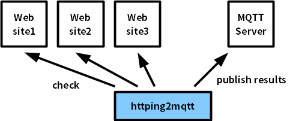

httping2mqtt.rb
====
simple web site monitoring script

    * 

How to use
----

    $ sudo apt-get install httping
    $ mkdir ~/work
    $ cd work
    $ git clone git clone https://github.com/yoggy/httping2mqtt.git
    $ cd httping2mqtt
    $ cp mqtt_config.yaml.sample mqtt_config.yaml
    $ vi mqtt_config.yaml
  
        host:     mqtt.example.com
        port:     1883
        use_auth: true
        username: username
        password: password
        interval: 300
  
    $ cp target_url_config.yaml.sample target_url_config.yaml
    $ vi larget_url_config.yaml
  
        - target_url: http://www1.example.com/
          dst_topic: topic/www1.example.com
        
        - target_url: http://www2.example.com/
          dst_topic: topic/www2.example.com
        
        - target_url: http://www3.example.com/
          dst_topic: topic/www3.example.com
  
    $ ruby ./httping2mqtt.rb

Copyright and license
----
Copyright (c) 2016 yoggy

Released under the [MIT license](LICENSE.txt)

